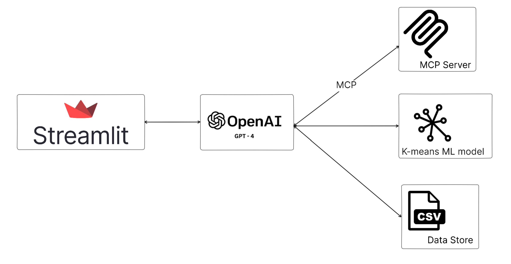
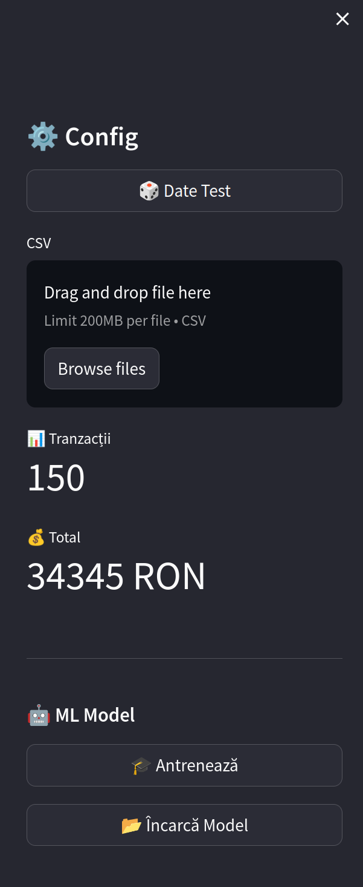
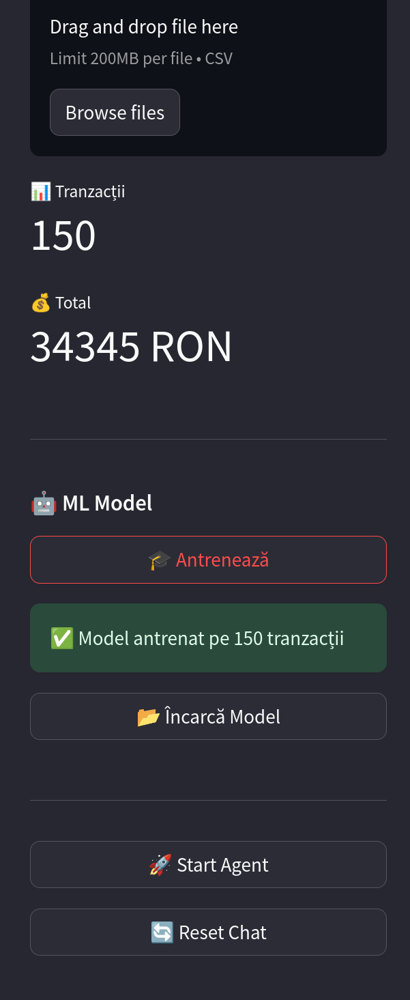
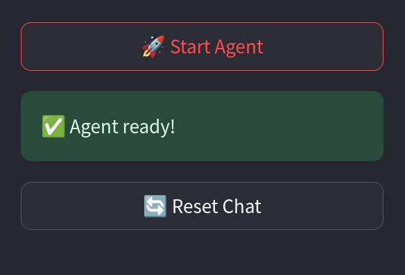
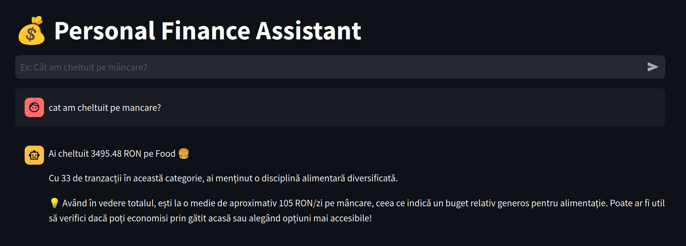

#  MCP-Spendwise-Assistant - Personal Finance Assistant

An intelligent personal finance management system that combines **Model Context Protocol (MCP)**, **OpenAI GPT-4**, and **Machine Learning** to help users understand spending habits and make better financial decisions through natural language conversations.


##  Features

- **Conversational AI Interface**
  - Natural language financial queries in Romanian/English
  - Context-aware responses with personalized insights
  
- **ML-Powered Categorization**
  - K-means clustering automatically categorizes transactions
  - TF-IDF feature extraction from transaction descriptions

- **Interactive Analytics Dashboard**
  - Real-time visualization with Plotly charts
  - Monthly spending trends and category breakdowns
  
- **MCP Integration**
  - Standardized data access through Model Context Protocol
  - Extensible architecture for multiple data sources

- **Full Docker Support**
  - Zero host installation required
  - Production-ready containerization

## Use Cases

Ask natural questions like:
- "How much did I spend on food this month?"
- "Show me my spending trends"
- "Compare January vs February expenses"
- "What's my biggest spending category?"
- "How can I optimize my budget?"

## Architecture



## Quick Start

### Prerequisites

- Docker & Docker Compose installed
- OpenAI API key ([Get one here](https://platform.openai.com/api-keys))

### Installation

```bash
chmod +x setup.sh

./setup.sh

cd finance-assistant

nano .env

docker-compose build

docker-compose up

# 7. Access in browser
# http://localhost:8501
```
### .ENV requirements

```bash
OPENAI_API_KEY=""
ENVIRONMENT=development
MCP_SERVER_HOST=mcp-server
MCP_SERVER_PORT=8000

```

### First Time Setup (In UI)

1. **Generate Test Data** - Click "🎲 Generate Test Data" in sidebar (150 sample transactions)
2. **Train ML Model** - Click "🎓 Train Model" (takes ~10 seconds)
3. **Initialize Agent** - Click "🚀 Start Agent"
4. **Start Chatting!** - Ask: "How much did I spend on food?"

##  Tech Stack

### Backend
- **Python 3.11** - Core runtime
- **MCP (Model Context Protocol)** - Standardized data access
- **OpenAI GPT-4** - Natural language understanding with function calling
- **Scikit-Learn** - K-means clustering for auto-categorization

### Frontend
- **Streamlit** - Interactive web UI
- **Plotly** - Beautiful interactive charts

### Infrastructure
- **Docker & Docker Compose** - Containerization
- **Multi-container architecture** - App + MCP Server

### Data
- **Pandas** - Data processing
- **CSV storage** - Persistent volume mounting

##  Features Breakdown

### Conversational AI
- Understands natural language queries in context
- Function calling to access transaction data
- Remembers conversation history
- Provides insights beyond raw numbers

### Machine Learning
- **Unsupervised learning** with K-means clustering
- **TF-IDF vectorization** for text features
- Automatically learns transaction patterns
- Categorizes: Food, Transport, Entertainment, Shopping, Bills, Other

### Analytics Dashboard
- **Pie charts** - Spending distribution by category
- **Line charts** - Monthly spending trends
- **Metrics** - Total, average, max spending
- **Interactive tables** - Filterable transaction history


## Images and Streamlit UI:

# Config Menu
<p align="center">
  
  <br>
  <em>Config Menu-Data Generation-Overview</em>
</p>

# Train Ready
<p align="center">
  
  <br>
  <em>Train Ready</em>
</p>

# Agent Ready
<p align="center">
  
  <br>
  <em>Launch Agent</em>
</p>

# Try the a prompt
<p align="center">
  
  <br>
  <em>Answer</em>
</p>


##  Educational Value

This project demonstrates:

### Modern AI Integration
- **MCP Protocol** - Standardized way for LLMs to access data
- **Function Calling** - Structured tool use by AI agents
- **Agentic AI** - Autonomous decision-making systems

### ML Best Practices
- **Unsupervised learning** for unknown categories
- **Feature engineering** from text data
- **Model persistence** for production deployment

### Software Engineering
- **Microservices architecture** with Docker
- **Separation of concerns** (UI/Agent/ML/Data)
- **Production-ready** error handling and logging

